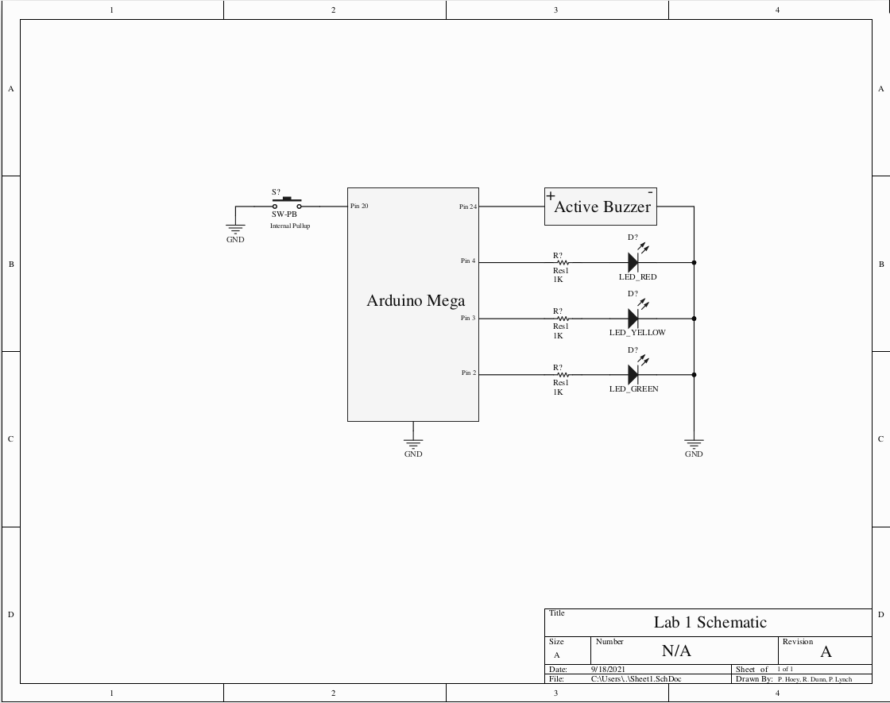

# Lab 1: Traffic Light Controller

Name: Patrick Hoey

Student ID #: 01769084

Team Members: Patrick Hoey, Ronan Dunn, Peter Lynch

Date of Completion: 9/18/21

Demonstration Method: Recorded

---
# 1. Design

---
## 1.1 Hardware Design

Also available in schematic.pdf

There's nothing to discuss in terms of design decisions. Simply put 3 current-limiting resistors in series with 3 LEDs, attach the active buzzer to a digital pin, and attach a switch to a pin capable of interrupts(internal pull-ups used).

---
## 1.2 Software Design

The software design is extremely simple. Designate pin output modes, utilize arduino library to handle timer setup, and run the state machine. The only pin assignment that had to be specific was the switch's interrupt capable pin wherein pin 20 was chosen.

The state machine updates dependent upon the interrupt from the switch, and after that based upon the time delay determined by delay().

*Insert the state machine diagram here, not my job*

---
## 1.3 Results
The results are as expected, view this video to see the circuit function:
https://drive.google.com/file/d/1D76UNPwpzK5dDcJ2ZpXMJEJGPHIAVswl/view?usp=sharing

---
# 2. Problems Encountered and Solved
There were no real problems encountered in this project. Initially a pin Incapable of interrupts was utilized for the switch, this was solved simply by switching it. There were no other problems encountered. This was spotted when the code didn't work, and a quick search showed I was using a pin that wasn't capable of interrupts.

---
# 3. Personal Contributions
Pat - Created the schematic in Altium and wired up the circuit and recorded the video of it functioning

Ronan - Designed and implemented state machine in code

Peter - Debugged interrupt issue and solved it so state machine would function

---
# 4. Lessons Learnt
There wasn't anything new learned in this lab. The only real lesson I suppose was to double-check which pins are interrupt capable before connecting up your circuit.